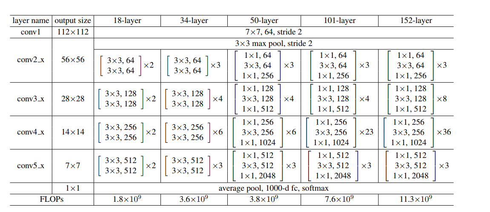

# Goal
replicate  the resnet-50 network from scratch

# the network architecture
I'll use the 3 bottleneck layers in the 34-layer net.
If the dimensions increase,I considered to use the option B (**using the projection shortcut used to match dimensions(done by 1*1 convolutions)**).And the shortcuts are performed with the stride of 2,when going across the feature maps of  the two sizes.

# Structure
****